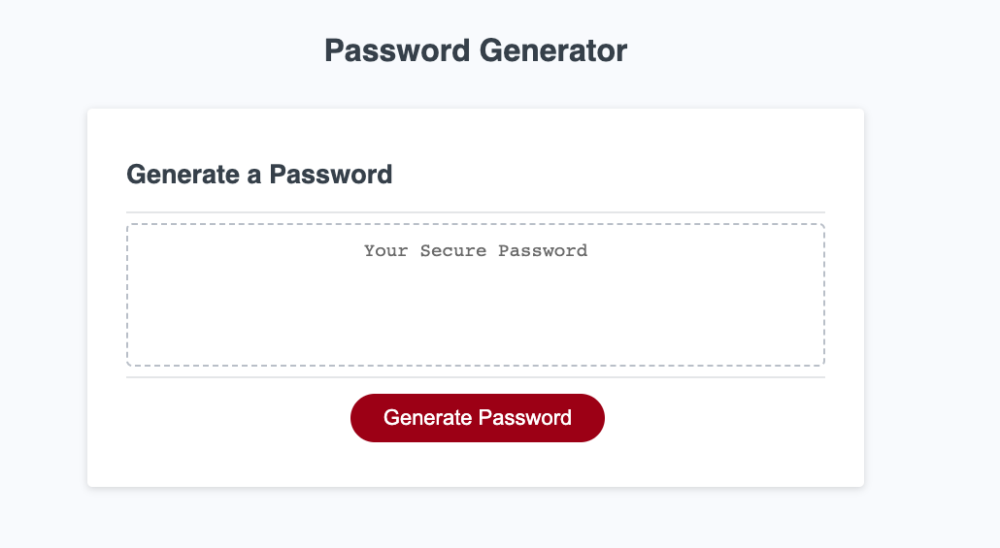

# Random Password Generator

A random password generator.

## Description

For this project I used Javascript functions to create a random password generator.

## Usage

The landing page has been deployed at: https://mariuml.github.io/password-generator/

Please follow the link to view the final version. You can select the generator button and follow the prompts on screen to create a password that fulfils your criteria.

## Credits

This page was built as part of a project for the 'Triology's Skills Bootcamp in Front-End Web Development', an assessed challenge for Module 5.

All starter code is credited to edX Bootcamp LLC. All Rights Reserved. See company website: https://www.edx.org/boot-camps 

## License

MIT License

Copyright (c) [2022] [Marium Ladha]

Permission is hereby granted, free of charge, to any person obtaining a copy
of this software and associated documentation files (the "Software"), to deal
in the Software without restriction, including without limitation the rights
to use, copy, modify, merge, publish, distribute, sublicense, and/or sell
copies of the Software, and to permit persons to whom the Software is
furnished to do so, subject to the following conditions:

The above copyright notice and this permission notice shall be included in all
copies or substantial portions of the Software.

THE SOFTWARE IS PROVIDED "AS IS", WITHOUT WARRANTY OF ANY KIND, EXPRESS OR
IMPLIED, INCLUDING BUT NOT LIMITED TO THE WARRANTIES OF MERCHANTABILITY,
FITNESS FOR A PARTICULAR PURPOSE AND NONINFRINGEMENT. IN NO EVENT SHALL THE
AUTHORS OR COPYRIGHT HOLDERS BE LIABLE FOR ANY CLAIM, DAMAGES OR OTHER
LIABILITY, WHETHER IN AN ACTION OF CONTRACT, TORT OR OTHERWISE, ARISING FROM,
OUT OF OR IN CONNECTION WITH THE SOFTWARE OR THE USE OR OTHER DEALINGS IN THE
SOFTWARE.
